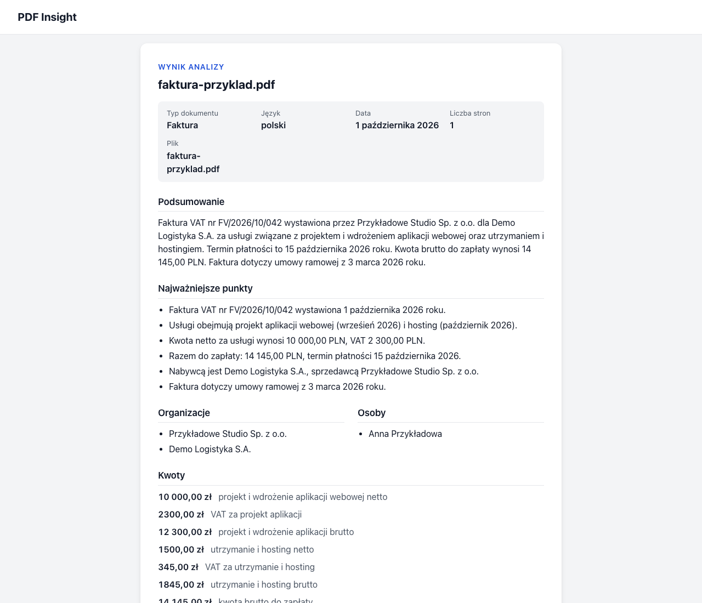
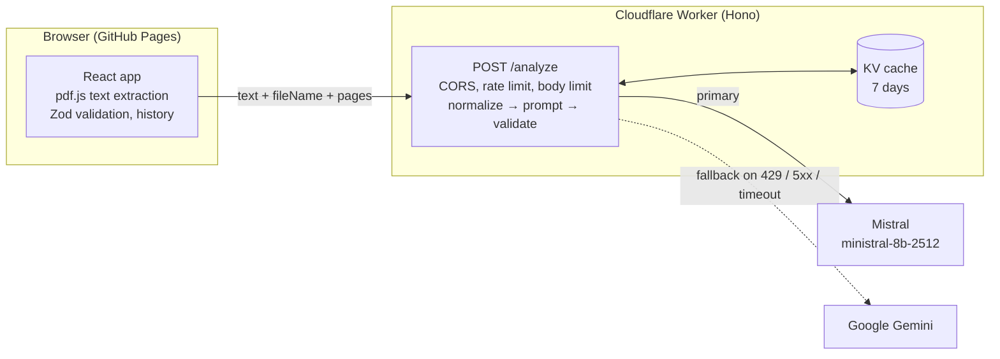

# PDF Insight

Upload a PDF and get a short summary plus structured JSON data (document type, key points, entities, amounts, dates, keywords), ready to preview and download.

**Live demo:** https://masterxxo.github.io/pdf-reader/



<sub>Screenshot of the production app analyzing a generated sample invoice (fictional companies and people).</sub>

## Features

| ID   | Priority | Feature                                                                                       | Status                                         |
| ---- | -------- | --------------------------------------------------------------------------------------------- | ---------------------------------------------- |
| F-01 | MUST     | Upload by drag & drop or file picker (keyboard accessible); PDF only, max 10 MB               | ✅                                             |
| F-02 | MUST     | Client-side text extraction with pdf.js; clear error for PDFs without a text layer            | ✅                                             |
| F-03 | MUST     | 3–5 sentence summary in the document's language, no invented information                      | ✅                                             |
| F-04 | MUST     | Structured data matching the schema, validated with Zod on the API and again before rendering | ✅                                             |
| F-05 | MUST     | Readable results view, JSON preview, copy and `.json` download                                | ✅                                             |
| F-06 | MUST     | Empty, loading (reading / analyzing) and error states with "Spróbuj ponownie"                 | ✅                                             |
| F-07 | MUST     | Public demo on GitHub Pages                                                                   | ✅                                             |
| F-08 | SHOULD   | Long documents: chunking + merge                                                              | ⚠️ implemented and tested, off in production\* |
| F-09 | SHOULD   | History of the last 10 analyses in `localStorage`, reopened without calling the API           | ✅                                             |
| F-10 | COULD    | OCR for scanned PDFs                                                                          | ❌ not implemented                             |

\* Chunked analysis cannot finish within the time budget on the free Mistral plan, so production analyzes up to ~50k tokens in one call and rejects longer texts up front. See [Known limitations](#known-limitations).

## Architecture



**Why the text is extracted in the browser.** The PDF itself never leaves the user's device; only the extracted text, the file name and the page count are sent. Requests stay small (the 10 MB limit applies to the file, not to the API body, which is capped at 1 MB), the worker needs no PDF parser, and a PDF without a text layer is detected before any API call.

**Monorepo layout** (pnpm workspaces):

```
apps/web         React 18 + Vite + TypeScript, deployed to GitHub Pages
  src/components UI components
  src/lib        pdf.js, file validation, formatting, export, history
  src/api        HTTP client for the worker (VITE_API_URL)
  e2e/           Playwright + axe suite (dev only)
apps/api         Hono on Cloudflare Workers; holds the LLM API keys
  src/lib        prompt, providers, time budget, cache, normalization, chunking, merge
  src/middleware CORS, rate limiting
packages/shared  Zod schemas + inferred types, API error codes, constants
```

**Single source of truth.** `packages/shared` defines the result schema with Zod. The API derives the JSON Schema for the model's structured output from it, validates the model output with it, and the web app validates the response with the same schema before rendering. History entries are validated with it again when read from `localStorage`. The TypeScript types for both apps are inferred from it, so a schema change surfaces as a type error on both sides.

### Analysis pipeline (`POST /analyze`)

1. **Normalize** the text: remove running headers and footers, page numbers and page markers, collapse whitespace (~4% fewer tokens on a dense report).
2. **Cache**: results live in KV for 7 days, keyed by a SHA-256 of the prompt and the normalized text (so a prompt change invalidates them). Only the analysis is cached; `fileName` and `pages` come from the request.
3. **Model call**: Mistral with strict JSON Schema output; Gemini as a fallback on 429, 5xx, timeouts and network errors. Output that is not valid JSON or does not match the schema gets one correction retry, after which the API returns 502 `LLM_INVALID_OUTPUT`.
4. **Time budget**: one 27 s deadline per request, shared by all calls. Each call gets the time left, and a retry or fallback with less than 8 s left is not started (504 `LLM_TIMEOUT` instead).
5. **Bounded output**: list caps in the schema (key points 7, organizations/people 15, amounts/dates 10, keywords 10), short contexts, `max_tokens` 3000.
6. **Long documents**: above `SINGLE_CALL_MAX_TOKENS` the text is split into chunks (map: compact partial result per chunk; reduce: lists merged and deduplicated in code, one model call for the summary). Production uses `MAX_CHUNKS=1`, which rejects such texts up front with 413 `TEXT_TOO_LONG`.

Every `/analyze` response has a `Server-Timing` header with the text size and each model call (duration, outcome, token usage), plus `X-Cache` and `X-LLM-Provider`.

## Key decisions

- **Cloudflare Workers + Hono.** GitHub Pages only serves static files, so the key has to live behind a backend. Workers have a free tier, no cold starts, built-in secrets, a rate limiting binding and KV. Hono adds routing plus CORS and body-limit middleware at a few kB.
- **Mistral as primary, Gemini as fallback.** Gemini was the first provider, but its free tier allows ~5 requests/min and ~20/day for the whole key, which a public demo exhausts quickly. Mistral's free plan allows ~30 requests/min. Only the Ministral models have quota on it (Small/Medium have 0), and `ministral-8b-2512` gave the best balance: ~11 s for a typical document with good Polish (14B took ~40 s, 3B was less precise). Gemini remains as a fallback when Mistral is rate-limited or down.
- **Structured output + Zod + one retry.** The model is constrained by a JSON Schema generated from the Zod schema. Its output is still validated with Zod, because providers do not enforce every constraint (formats, patterns). One correction retry sends the validation errors back to the model; a second failure is an error, as the brief requires.
- **Time budget.** The Definition of Done asks for results in under 30 s. Independent per-provider timeouts could add up past that, so all attempts share one 27 s deadline, and the client gives up at 40 s.
- **Output caps.** Generating output is ~97% of the latency (prefill of 21k input tokens took 1.5 s, 3,453 output tokens took 50 s). Capping list sizes and context lengths was the biggest latency win.
- **Text normalization.** Repeated headers, footers and page numbers cost tokens and add noise; removing them is cheap and deterministic.
- **Chunked path for long documents.** It is implemented and tested (map–reduce with list merging in code and one summary call), but on the free plan parallel requests are throttled and two chunks plus a merge take ~30 s. Production therefore does one call up to ~50k tokens (~20–25 s) and rejects longer texts immediately rather than after a timeout.
- **KV cache.** The same document analyzed again (a retry, or a recruiter trying the demo twice) is answered instantly and does not use the free-tier quota.
- **English enum values for `document.type`.** The brief's example uses Polish values (`faktura | umowa | oferta | raport | inne`), but it also requires keys in English and values in the document's language. A type enum is a machine-readable code, not document content, so it uses stable English values (`invoice | contract | offer | report | other`) regardless of the document's language. The UI maps them to Polish labels (Faktura, Umowa, Oferta, Raport, Inny). This is a deliberate deviation from the example.
- **Prompt-injection mitigation.** The document text is wrapped in `<document>…</document>`; delimiter tags inside the text are neutralized so the text cannot close the block. The system prompt says the content is untrusted data and that any instructions inside it must be ignored, and the user message repeats this right before the document. The output is constrained by the schema and validated, and it is only ever rendered as text.

## Security

- **API keys** live only in the worker: `wrangler secret put` in production and `apps/api/.dev.vars` locally (git-ignored). The frontend only knows the worker URL. The full git history was checked for key patterns, and no `.env` or `.dev.vars` file was ever committed.
- **CORS** allows exactly `https://masterxxo.github.io` and `http://localhost:5173` (`ALLOWED_ORIGINS`). Other origins get no `Access-Control-Allow-Origin` header.
- **Rate limit**: 5 analyses per minute per IP (Workers rate limiting binding) → 429 with `Retry-After`. The binding counts per Cloudflare location and is eventually consistent, so short bursts can get a few more requests through.
- **Body limit**: 1 MB → 413. File type and the 10 MB size limit are checked in the browser (MIME type and `%PDF-` signature).
- **Data notice**: the upload screen says that the content is sent to an external AI API (Mistral, or Google Gemini as a fallback) and that confidential documents should not be uploaded.
- **No HTML injection**: model output is rendered only as React text nodes; there is no `dangerouslySetInnerHTML`, and errors never expose upstream response bodies.

## Local development

Prerequisites: Node 22.12+ (`.nvmrc`), pnpm (`corepack enable`), and a Mistral and/or Gemini API key.

```sh
pnpm install
cp apps/api/.dev.vars.example apps/api/.dev.vars   # fill in MISTRAL_API_KEY and/or LLM_API_KEY
pnpm dev:local                                      # API on :8787, web app on :5173
```

`pnpm dev:local` checks the Node version and the keys, installs dependencies and runs both apps with `VITE_API_URL` pointing at the local worker. To run them separately: `pnpm --filter @pdf-insight/api dev` and `VITE_API_URL=http://localhost:8787 pnpm --filter @pdf-insight/web dev`.

Checks (the same as CI):

```sh
pnpm format:check && pnpm lint && pnpm typecheck && pnpm test && pnpm build
```

End-to-end and accessibility tests (Playwright + axe on the production build, API mocked; run `pnpm --filter @pdf-insight/web exec playwright install chromium` once):

```sh
pnpm --filter @pdf-insight/web test:e2e
```

## Environment variables

| Name                     | App | Purpose                                                                             | Where it is set                                 |
| ------------------------ | --- | ----------------------------------------------------------------------------------- | ----------------------------------------------- |
| `VITE_API_URL`           | web | Base URL of the worker                                                              | GitHub Variables (CI); `apps/web/.env` locally  |
| `VITE_BASE`              | web | Base path; `/<repo>/` on GitHub Pages, `/` by default                               | Set by the workflow from the repository name    |
| `MISTRAL_API_KEY`        | api | Primary provider key                                                                | `wrangler secret`; `apps/api/.dev.vars` locally |
| `LLM_API_KEY`            | api | Gemini (fallback) key                                                               | `wrangler secret`; `apps/api/.dev.vars` locally |
| `MISTRAL_MODEL`          | api | Mistral model (`ministral-8b-2512`)                                                 | wrangler vars (`wrangler.toml`)                 |
| `LLM_MODEL`              | api | Gemini model                                                                        | wrangler vars                                   |
| `ALLOWED_ORIGINS`        | api | Comma-separated exact CORS origins                                                  | wrangler vars                                   |
| `SINGLE_CALL_MAX_TOKENS` | api | Largest text (estimated tokens) analyzed in one call (default 50000)                | wrangler vars                                   |
| `MAX_CHUNKS`             | api | Max chunks for long texts; `1` rejects them instead (default 1)                     | wrangler vars                                   |
| `CHUNK_CONCURRENCY`      | api | Chunks analyzed in parallel (default 2)                                             | wrangler vars                                   |
| `DEBUG`                  | api | `1` logs request timings and model attempts                                         | `apps/api/.dev.vars` only                       |
| `E2E_BASE_URL`           | e2e | Run the Playwright suite against a deployed URL instead of a local build (optional) | Shell                                           |

Bindings in `wrangler.toml`: `ANALYSIS_CACHE` (KV) and `ANALYZE_RATE_LIMITER` (rate limiting).

## Deployment

- **Web**: every push to `main` runs `.github/workflows/deploy.yml`: format check → lint → typecheck → test → build (with `VITE_BASE` and `VITE_API_URL`) → `actions/deploy-pages`. The pdf.js worker is loaded with `new URL(..., import.meta.url)`, so it resolves under the `/pdf-reader/` base path. The app has no router, so GitHub Pages needs no 404 fallback.
- **API**: deployed manually from a clean, committed tree:

  ```sh
  cd apps/api
  pnpm exec wrangler secret put MISTRAL_API_KEY
  pnpm exec wrangler secret put LLM_API_KEY
  pnpm run deploy
  ```

## Known limitations

- **No OCR.** Scanned PDFs without a text layer are rejected with a clear message (F-10 not implemented).
- **Free-tier limits and variable latency.** Mistral's free plan allows ~30 requests/min and its output speed varies from ~20 to ~90 tokens/s; Gemini allows ~20 requests/day. During slow periods even a short document can hit the 27 s budget ("Analiza nie zmieściła się w limicie czasu"); retrying usually works. The API allows 5 analyses per minute per IP.
- **Practical length limit: about 130,000 characters (~50k tokens).** That is ~29 pages of dense, small-print text, or more pages of typical documents. Longer texts are rejected immediately with a suggestion to send a shorter document. Measured end to end on production (dense Polish report, 10 pt A4):

  | Document              | Time             |
  | --------------------- | ---------------- |
  | 2 pages (9k chars)    | 14–15 s          |
  | 12 pages (57k chars)  | ~17 s            |
  | 29 pages (140k chars) | 20–21.5 s        |
  | 30 pages (145k chars) | rejected (0.3 s) |

- **Chunked analysis is off by default** (see F-08). `MAX_CHUNKS=2` enables it on a plan with real parallel requests.
- **Capped lists.** At most 10 amounts, 10 dates and so on; for documents with more, the model keeps the most important ones.
- **CJK fonts without cMaps.** pdf.js is used without the bundled CMap files, so some PDFs with CJK fonts may extract garbled or no text.
- **Document content goes to third parties.** The extracted text is sent to Mistral AI and, on fallback, to Google. The UI warns about this.
- **History is local.** It is stored only in this browser's `localStorage` (last 10 analyses). It is not synced, and it is unavailable when storage is blocked (then the app works without it).
